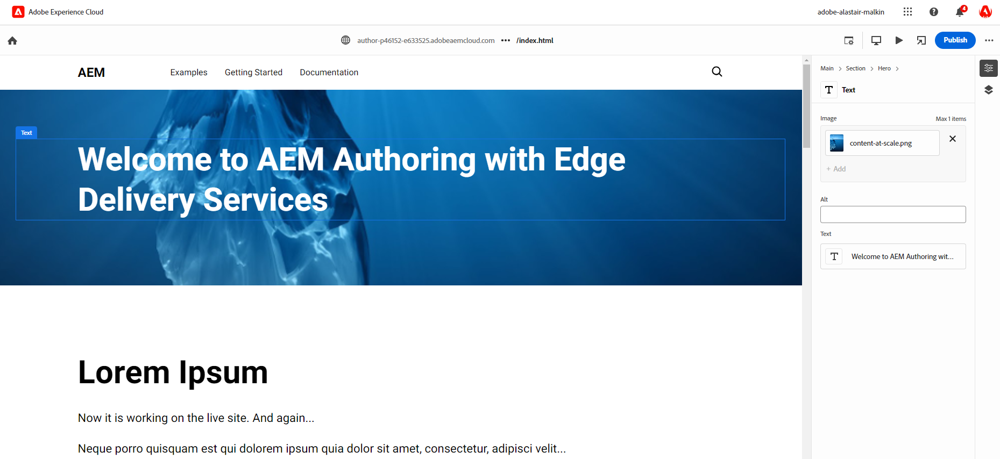

# Your Project's Title...
A site hosted on Git, structure hosted as a Site based upon a Template in AEMaaCS and edited via the Universal Editor.



[Site created](https://author-p46152-e633525.adobeaemcloud.com/ui#/@alastairmalkin/aem/universal-editor/canvas/author-p46152-e633525.adobeaemcloud.com/content/aem-edge-getting-started/index.html)

Page: https://main--aem-edge-getting-started--amalkin.hlx.page/

SEE: https://experienceleague.adobe.com/en/docs/experience-manager-cloud-service/content/edge-delivery/aem-authoring/edge-dev-getting-started

## Environments
- Preview: https://main--aem-edge-getting-started--amalkin.hlx.page/
- Live: https://main--aem-edge-getting-started--amalkin.hlx.live/

## Installation

```sh
npm i
```

## Linting

```sh
npm run lint
```

## Local development

1. Create a new repository based on the `aem-boilerplate` template and add a mountpoint in the `fstab.yaml`
1. Add the [AEM Code Sync GitHub App](https://github.com/apps/aem-code-sync) to the repository
1. Install the [AEM CLI](https://github.com/adobe/helix-cli): `npm install -g @adobe/aem-cli`
1. Start AEM Proxy: `aem up` (opens your browser at `http://localhost:3000`)
1. Open the `{repo}` directory in your favorite IDE and start coding :)
